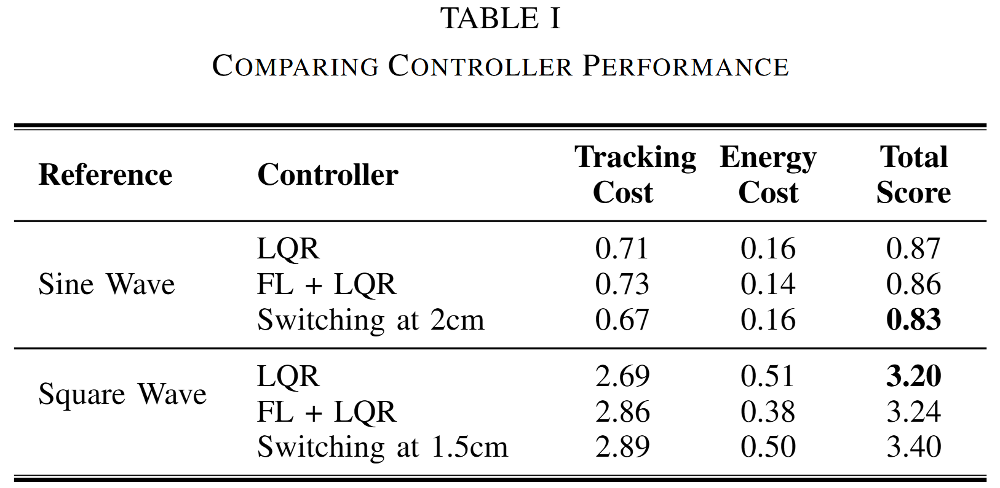

# UC Berkeley EE222/ME237 Nonlinear Systems Ball and Beam Project

EE222/ME237 Nonlinear Systems, Spring 2025 Course Project

## Group Members

Carlo Bosio, Seoyeon Choi, Spencer Schutz

## Abstract

A ball-and-beam is a classic nonlinear system for testing observer and control designs. We present an Extended Kalman Filter, tracking LQR, and approximate feedback linearization with LQR and discuss the performance following sinusoidal and square wave references. Our best performing implementation starts with the tracking LQR then switches to the feedback linearization when the error goes below a threshold (score = 0.83 for sinusoidal, 3.20 for square).

## Simulation Results

You can see the videos of the simulations below:

1. [Switching](files/Swtiching.mp4)

2. [LQR](files/LQR.mp4)

3. [FL + LQR](files/FL_LQR.mp4)
